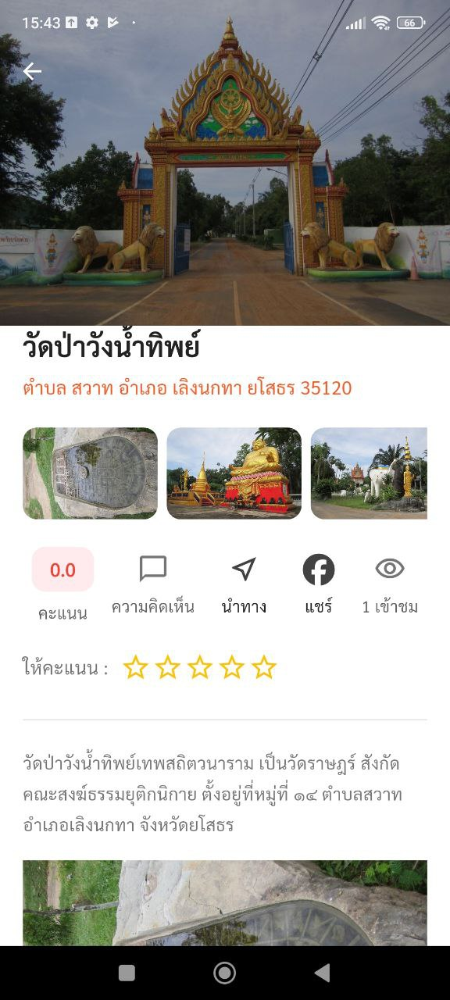
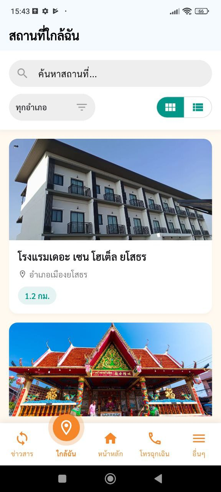

# 🏞️ Yasothon Travel App

แอปท่องเที่ยวยโสธรที่พัฒนาโดย **Flutter**
รองรับทั้ง **Android / iOS**
พร้อมระบบ **REST API เชื่อมต่อข้อมูลจาก WordPress**

[ทดลองใช้งานได้ที่ https://play.google.com/store/apps/details?id=com.travel.yasothon.go.th&hl=th](https://play.google.com/store/apps/details?id=com.travel.yasothon.go.th&hl=th)  
---

## ✨ คุณสมบัติเด่น

* 🗺️ แสดงสถานที่ท่องเที่ยว ร้านอาหาร และที่พักในจังหวัดยโสธร
* 🔍 ค้นหาสถานที่ได้แบบเรียลไทม์
* 📍 ดูตำแหน่งผ่าน Google Maps
* 📰 ดึงข้อมูลบทความจาก **WordPress REST API**
* 💬 รองรับภาษาไทยเต็มรูปแบบ

---

## 🛠️ เทคโนโลยีที่ใช้

| หมวด             | รายละเอียด                                                      |
| ---------------- | --------------------------------------------------------------- |
| Framework        | [Flutter](https://flutter.dev/)                                 |
| Backend / API    | [WordPress REST API](https://developer.wordpress.org/rest-api/) |
| State Management | Provider / Riverpod *(ตามที่ใช้)*                               |
| Maps             | Google Maps Flutter                                             |
| HTTP             | `http` package                                                  |
| Platform         | Android & iOS                                                   |

---

## 🖼️ ตัวอย่างหน้าจอแอป

| หน้าหลัก                             | รายละเอียด                             | แผนที่                           |
| ------------------------------------ | -------------------------------------- | -------------------------------- |
|  |  |  |

> 📷 ภาพตัวอย่างอยู่ในโฟลเดอร์ `screenshots/`

---

## 🚀 การติดตั้งและรันโปรเจกต์

```bash
# 1. โคลนโปรเจกต์
git clone https://github.com/strategy35000/yasothon_travel_app.git

# 2. เข้าโฟลเดอร์
cd yasothon_travel_app

# 3. ติดตั้ง dependencies
flutter pub get

# 4. รันบนอุปกรณ์
flutter run
```

---

## 📡 การเชื่อมต่อ WordPress REST API

1. ตั้งค่า URL ของ WordPress API ในไฟล์ `lib/config/api_config.dart` (ตัวอย่าง)

   ```dart
   const String baseUrl = 'https://your-wordpress-site.com/wp-json/wp/v2/';
   ```
2. ใช้ endpoint เช่น:

   * `/posts` → ดึงบทความทั้งหมด
   * `/categories` → ดึงหมวดหมู่
   * `/media` → ดึงภาพประกอบ

---

## 👨‍💻 ผู้พัฒนา

**พัฒนาโดย Flutter • รองรับ Android/iOS**
REST API ด้วย **WordPress**

**นายไกรศร เกษงาม**

* ตำแหน่ง: นักวิชาการคอมพิวเตอร์
* อีเมล: [kraisorn_ket@yasothon.go.th](mailto:kraisorn_ket@yasothon.go.th)
* โทรศัพท์: 086-474-6990
* หน้าที่ความรับผิดชอบหลัก: ออกแบบและพัฒนาแอป, ดูแลการเชื่อมต่อกับ WordPress REST API, แก้ไขบั๊ก, ให้คำปรึกษาด้านเทคนิค, และอัปเดตเนื้อหา/ฟีเจอร์ตามความต้องการของหน่วยงาน

**เวลาติดต่อ/การสนับสนุน (แนะนำ)**

* เวลาติดต่อ: จันทร์–ศุกร์ 09:00–16:30 (ยกเว้นวันหยุดราชการ)
* ช่องทางติดต่อหลัก: อีเมล (ตอบภายใน 48 ชั่วโมงทำการ) และโทรศัพท์สำหรับกรณีเร่งด่วน

---

## 📜 เงื่อนไขการใช้งาน (Terms of Use) — อย่างละเอียด (ภาษาไทย)

### 1. ขอบเขตการให้บริการ

Yasothon Travel App เป็นแอปพลิเคชันที่จัดทำขึ้นเพื่อให้ข้อมูลแนะนำการท่องเที่ยวในจังหวัดยโสธร ข้อมูล (เช่น สถานที่ บทความ รูปภาพ) มาจากฐานข้อมูล WordPress ที่กำหนดไว้ ผู้ใช้งานสามารถเรียกดูข้อมูล ค้นหา และนำทางไปยังสถานที่ต่าง ๆ ได้

### 2. สิทธิ์การใช้งาน

* ผู้ใช้ได้รับสิทธิ์ไม่เชิงพาณิชย์ ใช้งานแอปเพื่อการดูข้อมูลและนำทางส่วนบุคคลหรือเพื่อการศึกษาเท่านั้น
* ห้ามคัดลอก เผยแพร่ หรือจำหน่ายข้อมูลหรือซอฟต์แวร์นี้ในเชิงพาณิชย์โดยไม่ได้รับอนุญาตจากผู้พัฒนา/เจ้าของสิทธิ์

### 3. ข้อมูลผู้ใช้และความเป็นส่วนตัว

* แอปอาจเก็บหรือส่งข้อมูลจำเป็นบางอย่าง (เช่น ตำแหน่งเพื่อแสดงแผนที่) ไปยังบริการภายนอก (เช่น Google Maps) ตามที่ผู้ใช้อนุญาต
* ไม่เก็บข้อมูลลับ (credentials, รหัสผ่าน) บน repository สาธารณะ หากมีข้อมูลส่วนบุคคลใด ๆ เก็บไว้ จะมีการแจ้งประเภทของข้อมูลและวัตถุประสงค์ในการใช้งานในนโยบายความเป็นส่วนตัว (Privacy Policy) แยกต่างหาก

### 4. ความรับผิดชอบต่อข้อมูลจากภายนอก (Third-party data)

* แอปดึงข้อมูลจาก WordPress REST API และบริการภายนอก ผู้พัฒนาไม่รับผิดชอบต่อความถูกต้อง ความสมบูรณ์ หรือความทันสมัยของข้อมูลจากแหล่งภายนอกนั้น ๆ
* หากข้อมูลจาก WordPress ไม่ถูกต้องหรือมีการเปลี่ยนแปลง โพสต์ที่ลิงก์มาหรือสื่อที่เกี่ยวข้องอาจแสดงผลไม่ถูกต้องได้

### 5. ห้ามใช้ในทางผิดกฎหมายหรือเป็นภัย

ผู้ใช้ต้องไม่ใช้แอปเพื่อการกระทำที่ผิดกฎหมาย ละเมิดสิทธิ์บุคคลที่สาม หรือใช้เพื่อการโจมตีระบบคอมพิวเตอร์อื่น ๆ

### 6. การอัปเดตและการบำรุงรักษา

* ผู้พัฒนาอาจปล่อยอัปเดตเพื่อปรับปรุงความปลอดภัย แก้บั๊ก และเพิ่มฟีเจอร์ โดยไม่จำเป็นต้องแจ้งล่วงหน้าเสมอไป
* ผู้ใช้ควรอัปเดตเวอร์ชันให้เป็นปัจจุบันเพื่อความปลอดภัยที่ดีที่สุด

### 7. การจำกัดความรับผิด (Disclaimer & Limitation of Liability)

* แอปให้บริการ "ตามสภาพ" (as-is) โดยไม่มีการรับประกันใด ๆ ที่ชัดแจ้งหรือโดยนัยในเรื่องความเหมาะสมเพื่อการค้า ความถูกต้อง หรือไม่ละเมิดสิทธิ์ของบุคคลที่สาม
* ผู้พัฒนาไม่รับผิดชอบต่อความเสียหายที่เกิดขึ้นโดยตรง ทางอ้อม พิเศษ หรือผลตามมาจากการใช้แอป รวมถึงความเสียหายจากข้อมูลที่ผิดพลาดหรือการใช้งานฟังก์ชันนำทาง

### 8. การลิขสิทธิ์และทรัพย์สินทางปัญญา

* ซอร์สโค้ดและเอกสารใน repository นี้เป็นทรัพย์สินของผู้พัฒนา (เว้นแต่มีการระบุลิขสิทธิ์หรือใบอนุญาตอื่นไว้เป็นลายลักษณ์อักษร)
* หากต้องการใช้งานซอร์สโค้ดหรือส่วนประกอบเพื่อจุดประสงค์อื่น ให้ติดต่อผู้พัฒนาเพื่อขออนุญาต

### 9. การรายงานปัญหาและการขอเปลี่ยนแปลงข้อมูล

* กรณีพบบั๊ก ข้อมูลผิดพลาด หรือต้องการปรับปรุงเนื้อหา ให้ติดต่อทางอีเมล: **[kraisorn_ket@yasothon.go.th](mailto:kraisorn_ket@yasothon.go.th)** หรือสร้าง issue บน GitHub repo โดยระบุรายละเอียดและขั้นตอนการทำซ้ำ (repro steps)

### 10. การปกป้องคีย์/ข้อมูลสำคัญ

* ห้ามเก็บไฟล์คีย์ เช่น keystore (`*.jks`), รหัสผ่าน, token หรือ secrets อื่น ๆ ใน repository สาธารณะ หากจำเป็นต้องเก็บ ให้ใช้ secret manager/CI secret หรือไฟล์ที่ไม่ถูก track ด้วย `.gitignore`

### 11. การแก้ไขข้อกำหนด

* ผู้พัฒนาสามารถแก้ไขเงื่อนไขการใช้งานนี้ได้ โดยการประกาศใน README หรือเอกสารประกอบใน repo เวอร์ชันล่าสุดเป็นข้อบังคับบังคับใช้

### 12. กฎหมายที่ใช้บังคับและเขตอำนาจศาล

* ข้อกำหนดนี้อยู่ภายใต้กฎหมายของราชอาณาจักรไทย และข้อพิพาทใด ๆ ให้ตกอยู่ในเขตอำนาจของศาลไทย

---

## 📬 วิธีติดต่อและขอรับบริการ/สนับสนุน

* ผู้พัฒนา: **นายไกรศร เกษงาม** (นักวิชาการคอมพิวเตอร์)
* อีเมล: [kraisorn_ket@yasothon.go.th](mailto:kraisorn_ket@yasothon.go.th)
* โทรศัพท์: 086-474-6990
* ช่องทางแจ้งปัญหา: สร้าง Issue ใน GitHub repo หรือส่งอีเมลพร้อมรายละเอียด (ขั้นตอนการทำซ้ำ รูปภาพหน้าจอ ถ้ามี)

---

## 🪪 License

โปรเจกต์นี้เปิดให้ศึกษาและใช้งานเพื่อการเรียนรู้เท่านั้น
ห้ามนำไปใช้ในเชิงพาณิชย์โดยไม่ได้รับอนุญาต เว้นแต่จะมีการตกลงเป็นลายลักษณ์อักษรจากผู้พัฒนา

---
